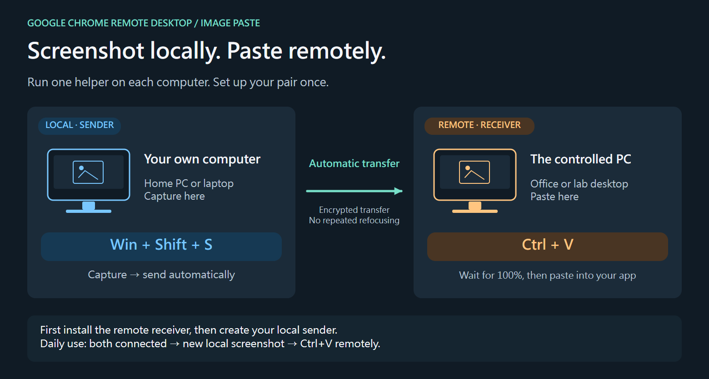
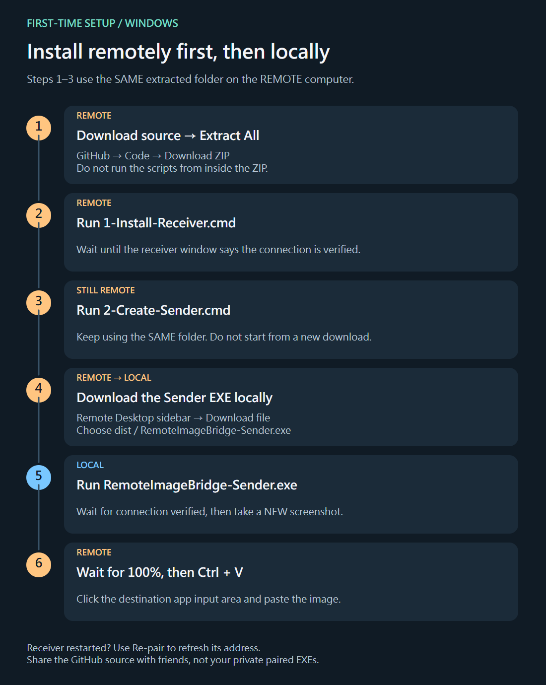

# Google Chrome Remote Desktop Image Paste

**Google Chrome 遠端桌面圖片貼上工具 — 本機截圖，遠端直接 Ctrl+V 貼上。**

**[Download source ZIP](https://github.com/evan6007/chrome-remote-desktop-image-paste/archive/refs/heads/main.zip)** · **[Full installation guide](docs/INSTALL.md)** · **[繁體中文圖解安裝](docs/INSTALL.zh-TW.md)**

Take a screenshot with Win+Shift+S on your local Windows computer, then press Ctrl+V to paste it on the computer you control through Google Chrome Remote Desktop.

This is an experimental **Windows desktop helper**, released as source under the MIT license. It is not a Chrome extension and is not affiliated with Google or Cloudflare. No store account is needed to build or use it.



Diagrams made with [Skechu](https://evan6007.github.io/skechu-ppt/); [download the editable SKC](docs/media/image-paste-guide.skc).

## What it does

- Watches new image clipboard changes on the sending computer, including Win+Shift+S captures.
- Transfers encrypted PNG data over HTTPS without requiring the remote-desktop tab to be focused for each transfer.
- Restores native PNG and DIB clipboard formats on the receiver so compatible desktop apps can paste with Ctrl+V.
- Shows progress, connection status and a completion receipt. Sender progress reaches 100% only after the receiver confirms that it wrote the clipboard.
- Keeps ordinary text on Chrome Remote Desktop's existing clipboard channel.
- Provides pause/resume, a tray menu and a status window that does not activate other windows or move the mouse.

## Before you start

- Two Windows desktop computers. Windows 11 has been the development environment; other versions are not verified.
- On the computer used to build the pair: Windows PowerShell 5.1 or PowerShell 7, with .NET Framework 4.8 and the bundled C# compiler. No Visual Studio, NuGet or paid API is required.
- Internet access on both computers. The current transport uses Cloudflare Quick Tunnels. They are intended for testing/development, have no uptime guarantee, and get a new URL when the receiver restarts. See [Cloudflare's documentation](https://developers.cloudflare.com/cloudflare-one/networks/connectors/cloudflare-tunnel/do-more-with-tunnels/trycloudflare/).
- One sender/receiver pair per Windows user profile. The current UI is Traditional Chinese.

**Each build pair contains its own secret. Never publish your generated EXEs, the `.private` directory, or a ZIP of your whole working directory.** Share source using GitHub's source archive; only send a generated Sender EXE to your own trusted sending computer. See [SECURITY.md](SECURITY.md).

## Installation at a glance

The **remote Receiver** is the computer you control inside Chrome Remote Desktop. The **local Sender** is the home computer or laptop whose keyboard you are using.

1. **On the remote computer:** download the source ZIP and choose **Extract All**.
2. In the extracted folder, double-click **`1-Install-Receiver.cmd`**. Wait for its status window to say connection verified.
3. **Still remotely, in the same folder:** double-click **`2-Create-Sender.cmd`**.
4. Use Chrome Remote Desktop's **Download file** action to transfer `dist\RemoteImageBridge-Sender.exe` to your local computer.
5. **On the local computer:** double-click that Sender EXE and wait for connection verified.
6. Make a new local **Win+Shift+S** screenshot, wait for **100%**, then **Ctrl+V** in an image-capable app on the remote desktop.

**[Follow the complete illustrated guide →](docs/INSTALL.md)** It covers opening the ZIP, exactly which computer each step runs on, the console/status messages, re-pairing, updates, removal and troubleshooting. [繁體中文完整圖解 →](docs/INSTALL.zh-TW.md)



### Code signing policy

This is currently an **unsigned source/testing release**, not a signed one-click product download. The launchers automate the private build; they do not supply a trusted publisher certificate. A reusable signed installer with runtime pairing is planned but not implemented. [Current status and distribution options](docs/CODE-SIGNING.md).

## Controls and removal

- `暫停 / 繼續`: pause/resume clipboard bridging. An upload already in flight may finish; quit the helper to stop it completely.
- Close the status window to hide it; double-click the tray icon or installed EXE to show it again.
- Tray `停止並取消開機啟動`: stop and remove this tool's current-user login startup entry.
- The installed executable, state files and optional tunnel binary are in `%LOCALAPPDATA%\RemoteImageBridge`.
- Startup uses `HKCU\Software\Microsoft\Windows\CurrentVersion\Run`, value `RemoteImageBridge`. No administrator privilege is needed.

## Limits and privacy

- Single-direction image sync, up to 24 MiB and 36 million pixels per image. PNG is not converted to JPEG or resized.
- If several images arrive during a transfer, the latest queued image replaces earlier queued images.
- While enabled, **newly copied images are automatically transmitted**. Pause it when you do not want images shared.
- Image bytes are processed in memory; the helper does not save screenshots to disk or log image/ordinary-text contents. Metadata logs include timestamps, state, sizes and diagnostic process names; the legacy decoder can log image hashes.
- The receiver briefly restores its last image when Chrome Remote Desktop overwrites it with empty text. Newly copied ordinary text/another image invalidates that cached image. Clipboard handling differs between applications and requires real-device testing.
- A low-level keyboard hook checks Ctrl+V / Shift+Insert to strip the helper's control markers and handle empty-text overwrites. It does not record typed text, synthesize keys, move the mouse, or change input-method settings.
- Cloudflare receives the HTTPS request and forwards application-encrypted image bytes. The shared pairing secret and separate image encryption key are not transmitted as HTTP fields. Metadata such as traffic size and timing remains visible to the transport provider.
- Both computers' clocks must be reasonably synchronized (within five minutes).

## Validation and current status

The included `--self-test` suite checks chunk assembly compatibility, limits, hashes, image validation, native memory conversion, clipboard protection rules, authenticated encryption and endpoint validation. It does not change the user's live clipboard or prove cross-machine paste success.

Run developer validation in a separate fresh checkout; the placeholder Sender below is not an installer for a live pair:

```powershell
.\scripts\Build.ps1 -Role Receiver -SelfTest
.\scripts\Build.ps1 -Role Sender -Endpoint https://example-tunnel.trycloudflare.com -SelfTest
.\scripts\Check-PublicTree.ps1
```

The last command checks the Git-tracked file list; run `git add` before using it for a release. CI compiles both roles, runs logic tests and checks tracked source. CI deliberately does **not** upload generated binaries, which contain pairing credentials.

The predecessor prototype passed an encrypted Internet loopback probe with approximately 1.77 MB in 0.46 seconds and 7.09 MB in 1.25 seconds. Those were receiver-to-Cloudflare-to-receiver synthetic probes, not measurements from a second physical computer and not a performance promise for this release. The public fork requires independent two-computer validation.

## Contributing

Issues and pull requests are welcome. Useful next steps are a reusable installer with runtime pairing, eliminating the remaining focus-dependent re-pairing step, English UI, and a durable self-hosted transport option. Never include screenshots, pairing keys, private builds or unsanitized logs in public issues.

## License

MIT; see [LICENSE](LICENSE). Cloudflare's separately downloaded `cloudflared` has its own Apache-2.0 license; see [THIRD_PARTY_NOTICES.md](THIRD_PARTY_NOTICES.md).
