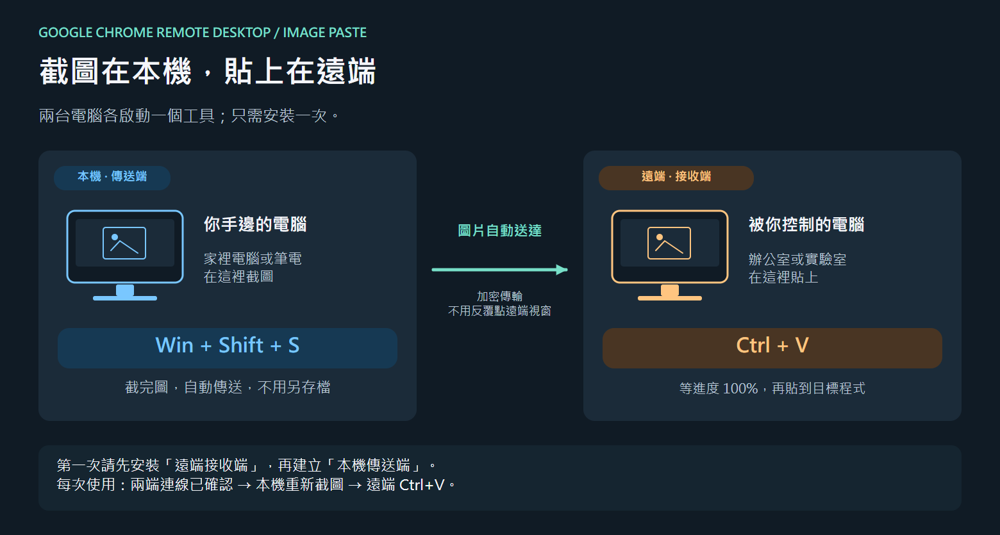
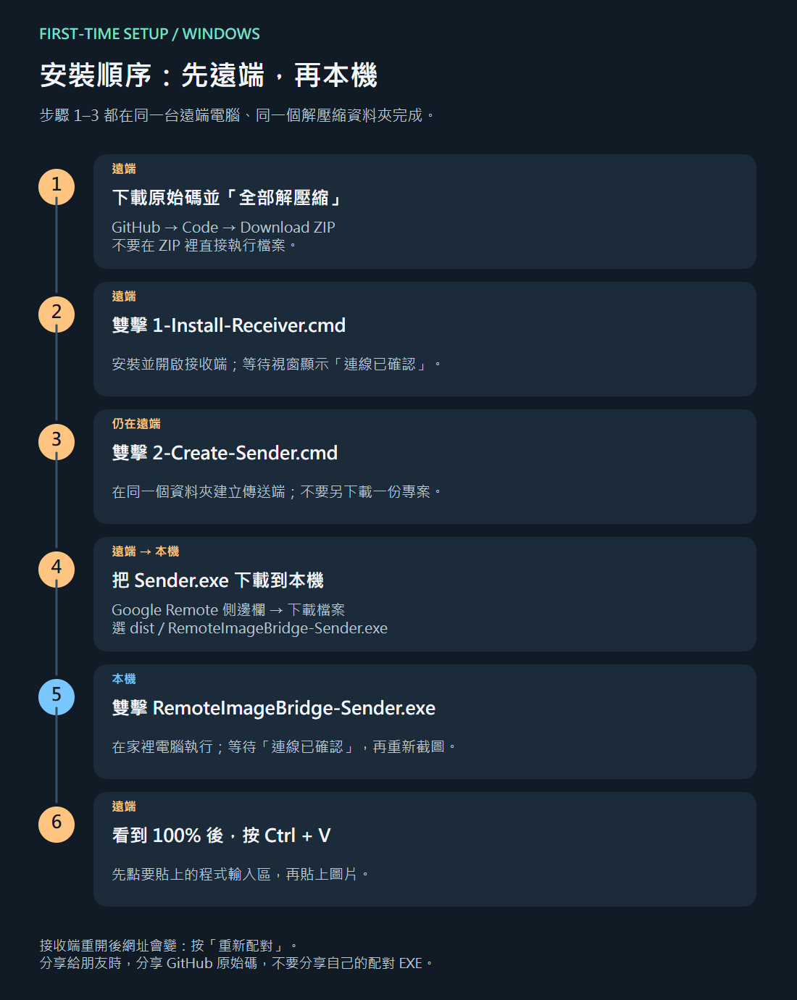

# 完整安裝與使用教學

**Google Chrome 遠端桌面圖片貼上工具：本機截圖，遠端直接 Ctrl+V。**

[回專案首頁](../README.zh-TW.md) · [English guide](INSTALL.md) · **[下載最新原始碼 ZIP](https://github.com/evan6007/chrome-remote-desktop-image-paste/archive/refs/heads/main.zip)**

這份教學從下載開始，不需要先裝 Git、Visual Studio、Node.js 或 Chrome 外掛。目前是 Windows 原始碼實驗版；兩個啟動腳本會利用 Windows 隨附的編譯器，為你自己的兩台電腦產生配對工具。

**簽章現況：目前產生的 EXE 未簽章，這是原始碼測試流程，不能保證免 Windows 警告。[簽章與正式安裝規劃](CODE-SIGNING.md)。**

## 先分清楚「本機」和「遠端」

| 名稱 | 是哪台？ | 要做什麼？ |
| --- | --- | --- |
| **本機／傳送端** | 你人坐在前面，正在按鍵盤的電腦，例如家裡電腦、筆電 | 按 Win+Shift+S 截圖，啟動 Sender |
| **遠端／接收端** | 出現在 Google Remote 畫面內，被你控制的另一台電腦，例如辦公室電腦 | 先建置兩個工具，啟動 Receiver，之後按 Ctrl+V 貼上 |

例如：你在家控制辦公室電腦，**先在遠端畫面裡的辦公室電腦完成步驟 1–3**，再把產生的 Sender 下載到家裡。



圖由 [Skechu](https://evan6007.github.io/skechu-ppt/) 繪製；可下載 [可編輯 SKC 原稿](media/image-paste-guide.skc) 或 [SVG](media/overview-zh.svg)。這是流程示意圖，不是實際連線成功的截圖。

## 開始前需要什麼？

- 兩台 Windows 電腦，兩台都能上網。開發環境為 Windows 11；其他系統尚未完成驗證。
- 可以正常使用 Google Chrome 遠端桌面，已連進遠端電腦。
- 遠端電腦具有 Windows PowerShell 和 .NET Framework 4.8。若缺少編譯器，程式會在黑色視窗顯示原因。
- 遠端首次安裝會下載約 55 MB 的 Cloudflare 網路元件。它有自己的官方簽章，腳本會驗證下載內容。
- 安裝時保留整個解壓縮專案資料夾，之後建立傳送端、更新時都要用同一份。



## 步驟 1：在遠端下載與解壓縮

1. 在 Google Remote 的**遠端畫面內**，開啟瀏覽器，進入 [本專案](https://github.com/evan6007/chrome-remote-desktop-image-paste)。
2. 按綠色 **Code → Download ZIP**。也可以直接點本頁上方的「下載最新原始碼 ZIP」。
3. 到遠端電腦的「下載」資料夾，對下載的 ZIP 按右鍵，選 **全部解壓縮**。
4. 進入解壓縮後的專案資料夾。應該同時看到：

```text
chrome-remote-desktop-image-paste-main/
├── 1-Install-Receiver.cmd    ← 先雙擊這個
├── 2-Create-Sender.cmd       ← 接收端連線後，再雙擊這個
├── scripts/
├── src/
└── README.md
```

**不要在 ZIP 預覽畫面直接執行。** 如果只看到另一個同名資料夾，再進去一層；如果沒看到上述兩個 `.cmd`，請確認下載的是本頁的最新 `main` 原始碼。

## 步驟 2：仍在遠端，安裝接收端

1. 雙擊 **`1-Install-Receiver.cmd`**。
2. 會出現黑色視窗，依序顯示：建置及自我檢查 → 下載並驗證 Cloudflare 元件 → 啟動接收端。
3. 等圖片橋接的狀態視窗出現。角色應為 **接收端**。
4. 等狀態顯示 **「連線已確認，等待圖片」**，再往下一步。剛出現視窗或看到編譯 `PASS`，都不代表網路已連線。
5. 黑色視窗顯示完成後可以關閉；圖片橋接工具會繼續在通知區執行。

安裝位置是遠端的 `%LOCALAPPDATA%\RemoteImageBridge`，只設定目前使用者登入後啟動。啟動腳本的 PowerShell 執行選項只對本次程序有效，不更動全機的執行原則；公司／學校若有管理限制，請依管理規定處理。

## 步驟 3：還是在遠端，建立傳送端

1. 回到**剛才同一個解壓縮專案資料夾**。
2. 雙擊 **`2-Create-Sender.cmd`**。
3. 等黑色視窗出現 **`READY TO TRANSFER`**。
4. 開啟專案內的 `dist` 資料夾，找到：

```text
RemoteImageBridge-Sender.exe
```

這個 EXE 已帶入你的配對資料，稍後要在**本機**安裝。不要在這一步雙擊它；在遠端誤執行 Sender 會把那台的接收工具換成傳送角色。

每次建置會使用專案 `.private` 資料夾裡的密鑰。**不要為了建立 Sender 又重新下載另一份專案**，兩邊會因此拿到不同密鑰。

## 步驟 4：把 Sender 下載到本機

1. 打開 Google Chrome Remote Desktop 畫面側邊的箭頭／選項面板。
2. 找到 **檔案傳輸 → 下載檔案**。這個方向是「從遠端電腦下載到本機」。
3. 在出現的遠端檔案選擇視窗中，進入剛才的專案 `dist` 資料夾，選 `RemoteImageBridge-Sender.exe`。
4. 等**本機瀏覽器**下載完成，再到本機的「下載」資料夾找這個 EXE。

請確認自己已回到本機桌面或本機檔案總管，下一步不是在 Google Remote 畫面裡操作。也可以使用你信任的其他方式傳送這個檔案。

## 步驟 5：在本機安裝傳送端

1. 雙擊剛下載的 **`RemoteImageBridge-Sender.exe`**。
2. 等工具的狀態視窗出現，角色應為 **本機傳送端**。
3. 等 **「連線已確認，等待圖片」**。到這裡才代表本機傳送端驗證到了接收端。
4. 兩端工具都保持執行，就可以開始用。

本機只需要這個 EXE，不需要再下載原始碼、安裝 Cloudflare 或跑兩個 `.cmd`。

## 每天怎麼用？

1. 確認兩端圖片橋接工具正在執行，且沒有暫停。
2. 在**本機**按 **Win+Shift+S**，框選要傳送的畫面。這次截圖要發生在工具啟動之後。
3. 圖片自動傳送。等傳送端顯示 **100%／「圖片已到遠端」**。
4. 在 Google Remote 畫面內，點選遠端程式能接收圖片的位置，再按 **Ctrl+V**。

不需要先存成 PNG、不需要每張圖使用「下載檔案」，也不需要反覆點 Google Remote 讓每段資料繼續。只能貼文字的輸入框不會因此支援圖片；請用本來就能接收圖片的目標程式。

工具啟用時，新複製的圖片會自動傳送。需要停止時按「暫停」；已在傳的一張可能會完成，要完全停止請結束工具。

## 視窗狀態代表什麼？

| 看到的狀態 | 意義／下一步 |
| --- | --- |
| 正在建立圖片連線 | 接收端還在建立網路通道，先等候 |
| 連線已確認，等待圖片 | 網路及配對驗證已通過，現在可以重新截圖 |
| 0–90% | 正在傳送／接收圖片 |
| 95%／等待遠端確認 | 還沒完成，先不要把這個狀態當成已貼上 |
| 100%／圖片已到遠端 | 接收端已確認將圖片放進剪貼簿，現在按 Ctrl+V |
| 圖片尚未送達／重新配對 | 這張尚未確認送達，依下面的配對或排錯步驟處理 |

接收端的進度分配與傳送端不同，不要求兩邊每一刻的百分比相同。

## 遠端重開機或工具重啟後，如何重新配對？

目前使用的臨時網路網址會在接收端重啟後更換。

1. 先讓遠端接收端重新啟動，等它的連線建立完成。
2. 在**本機傳送端**按 **重新配對**。
3. 切回 Google Remote 遠端畫面一次，讓短配對訊息經原有的文字剪貼簿同步。
4. 如果沒有收到回覆，在**遠端接收端**按一次「重新配對」，再切回本機工具。
5. 等本機再次顯示「連線已確認」，再重新截圖。

這裡可能需要切換視窗；圖片本身仍然透過獨立網路傳送。

如果配對控制訊息無法同步：回到遠端**原本的專案資料夾**，重跑 `2-Create-Sender.cmd`，將新 Sender 下載回本機並安裝。如果仍保留舊網址，先結束本機工具，開啟 `%LOCALAPPDATA%\RemoteImageBridge`，**只刪除 `remote-endpoint.txt`**，再重新開啟已更新的工具。

## 常見問題

| 問題 | 處理方式 |
| --- | --- |
| ZIP 裡找不到 EXE | 正常：公開下載是原始碼，先在遠端執行 `1-Install-Receiver.cmd`，EXE 才會產生在 `dist` |
| 雙擊 `.cmd` 立即失敗／找不到 scripts | 先「全部解壓縮」，不要只把單一 `.cmd` 拖出來；兩個 `.cmd` 要和 `scripts`、`src` 在同一層 |
| 顯示 `.NET Framework C# compiler not found` | 接收端缺少建置需要的 Windows/.NET 元件；確認使用 64 位元 Windows 及 .NET Framework 4.8，必要時請管理員協助 |
| Cloudflare 下載失敗、403、逾時 | 確認遠端能連 GitHub。學校／公司的網路可能有限制；不要因為下載失敗而關閉防火牆 |
| `Start the Receiver and wait...` | 接收端還沒啟動、還沒取得網址，或使用者不同。先完成步驟 2，再執行步驟 3 |
| `Build the Receiver first...` | 現在這份資料夾沒有第一次產生的配對密鑰；回到原資料夾，不要重新下載一份 |
| 誤在遠端執行 Sender | 在遠端重新執行原資料夾的 `1-Install-Receiver.cmd`，等連線後再跑步驟 3–5 |
| 顯示連線已確認，但舊截圖沒傳 | 啟動前已在剪貼簿的圖片不會自動送出；請重新截圖或重新複製圖片 |
| 已到 100%，Ctrl+V 沒有圖片 | 確認焦點在遠端且目標程式支援圖片；不要在傳送後又複製其他文字。可換另一個能貼圖片的程式確認 |
| 只能收一張、或重開後斷線 | 先按上面的「重新配對」流程；確認兩端時鐘差距小於五分鐘 |
| Windows／組織封鎖執行 | 本工具的私人建置目前未做程式碼簽章；確認來源與組織規定，不要求關閉防毒或安全設定 |
| 按 X 後找不到工具 | X 是收至通知區；雙擊通知區圖示，或開啟 `%LOCALAPPDATA%\RemoteImageBridge\RemoteImageBridge.exe` |

若要回報問題，提供角色、版本與錯誤文字即可。日誌位於工具資料夾的 `sender-events.log`／`receiver-events.log`；公開貼出前先檢查內容，**不要附配對 EXE、`.private`、工作資料夾 ZIP 或私人圖片**。

## 更新、移除及分享

- **更新：** 在遠端更新原專案的公開檔案，保留 `.private`，再依序跑 1、2。若選擇全新資料夾，會產生全新配對，兩端都要重新安裝。
- **停止並取消登入啟動：** 兩端各自從通知區選單選「停止並取消開機啟動」。
- **完整移除：** 停止工具後，可以刪除該台 `%LOCALAPPDATA%\RemoteImageBridge` 資料夾；如果保留原專案就保留配對資料，不再需要時再自行移除。
- **分享給朋友：** 分享 [GitHub 連結](https://github.com/evan6007/chrome-remote-desktop-image-paste)，讓朋友建置自己的配對，不分享你的私人 EXE。

## 可選：想直接使用 PowerShell

請在**遠端的已解壓縮專案資料夾**開啟 PowerShell。可以在檔案總管位址列輸入 `powershell` 後按 Enter，再依序執行：

```powershell
.\scripts\Build.ps1 -Role Receiver -SelfTest
.\scripts\Install-Tunnel.ps1
```

雙擊 `dist\RemoteImageBridge-Receiver.exe` 並等它連線成功，接著仍在同一份專案執行：

```powershell
.\scripts\Build.ps1 -Role Sender -UseRunningReceiver -SelfTest
```

將產生的 Sender 下載到本機，從步驟 5 繼續。

## 目前驗證範圍

目前是原始碼實驗版。建置、自我測試和教學素材可在隔離環境驗證；這不等於所有 Windows、網路或貼上目標都完成了兩台實機測試。圖片上限為 24 MiB／3600 萬像素。臨時 Cloudflare 通道定位為開發測試用途，不提供長期可用性保證。[完整技術限制](../README.md#limits-and-privacy)
